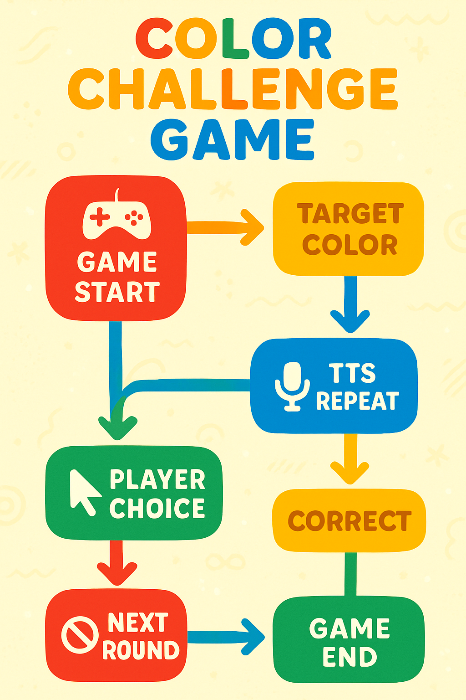

# Color Challenge Game

Welcome to the **Color Challenge Game**! This is a fun and educational game designed to help kids learn and recognize colors through an interactive experience.

## Game Overview

The game challenges players to find the correct color tile based on a spoken prompt. It features:

- 10 rounds of color matching fun
- Text-to-Speech (TTS) audio prompts repeating the target color
- Colorful grid of tiles to pick from
- Positive feedback animations with confetti on correct answers
- Encouraging try-again messages on wrong choices
- Round progression with no repeated target colors in consecutive rounds

## How to Play

1. Press **Start Over** to begin the game.
2. Listen to the TTS prompt instructing you to "Find [ColorName]".
3. Click on the color tile you think matches the prompt.
4. If correct, confetti explodes and the round advances.
5. If wrong, try again with the prompt repeating every 5 seconds.
6. Complete all 10 rounds to win!

## Game Logic Flow Diagram

Below is the editable SVG flow diagram illustrating the game logic from start to finish. It matches the game’s colorful UI palette for an engaging visual guide:

## Dependencies

- Flutter SDK (Dart 3.8.1 or higher)
- flutter_tts (Text-to-Speech)
- confetti (for confetti animations)
- Comic Neue font for playful UI styling

## Files Overview

- `color.dart`: Defines available colors and their names.
- `confetti.dart`: Confetti animation widget.
- `game.dart`: Main game logic and UI.
- `main.dart`: App entry point.
- `pubspec.yaml`: Project metadata and dependencies.

---

Feel free to use, modify, and share this project!

Happy Coloring! 🎨✨
